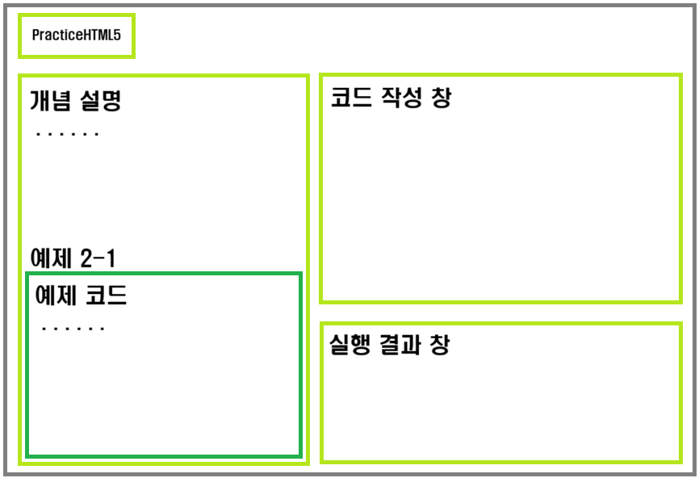

# HTML5 실습 사이트 개발

## 개발 동기
```
방송대 컴퓨터과학과 전공 강의를 들으며 실습을 할 때,
강의를 들으며 따로 Visual Studio Code에서 코드를 따라 쓰며 실습을 했는데 실습 코드만 따로 모아서 한번에 연습할 수 있는 사이트가 있으면 좋겠다는 생각이 들었습니다.
그래서 올해 수강 중인 HTML5 교재의 코드를 실습할 수 있는 사이트를 만들어 보게 되었습니다.
```

## 개발 하고 싶은 기능
1. 교재의 예제 실습   
    1) 실습 예제 관련 개념 설명
    2) 실습 예제 코드 제시  
    3) 실습 예제 코드 따라 쓰기  
    4) 실습 예제 코드 실행  
        i) 작성한 코드 실행 결과 보기  
        ii) 작성한 코드 오류 잡기  
2. 교재의 연습 문제 풀이

## 개발 내용

### 1. 교재의 예제 실습

#### 실습 페이지 구성  

- 구성
    - 설명
    - 예제 코드
    - 코드 작성 창
    - 실행 결과 창
- 조건 1: 가독성



