# HTML5 실습 사이트 개발

## 개발 동기
```
방송대 컴퓨터과학과 전공 강의를 들으며 실습을 할 때,
강의를 들으며 따로 Visual Studio Code에서 코드를 따라 쓰며 실습을 했는데 실습 코드만 따로 모아서 한번에 연습할 수 있는 사이트가 있으면 좋겠다는 생각이 들었습니다.
그래서 올해 수강 중인 HTML5 교재의 코드를 실습할 수 있는 사이트를 만들어 보게 되었습니다.
```

## 개발 하고 싶은 기능
1. 교재의 예제 실습   
    1) 실습 예제 관련 개념 설명
    2) 실습 예제 코드 제시  
    3) 실습 예제 코드 따라 쓰기  
    4) 실습 예제 코드 실행  
        i) 작성한 코드 실행 결과 보기  
        ii) 작성한 코드 오류 잡기  
2. 교재의 연습 문제 풀이

## 개발 내용

### 1. 교재의 예제 실습

#### 실습 페이지 구성  

- 구성
    - 설명
    - 예제 코드
    - 코드 작성 창
    - 실행 결과 창
- 조건 1: 가독성

- 2026.03.30 : 1차 완성
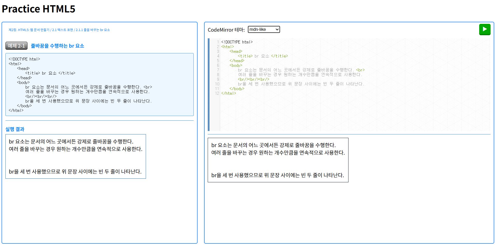
    - 트러블 슈팅💥
        1. **예제 코드에 raw code가 아닌 실행 결과가 보임**
            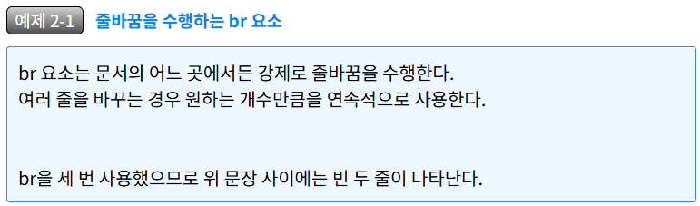

            - 원인: 예제 코드의 html 태그를 웹 페이지에서 그대로 출력하는 것이 아니라 html 문서의 태그로 인식하여 태그 실행 결과가 보이는 것이었음.

            - 1차 수정: <는 &lt;, >는 &gt;으로 변경
                > 결과: 태그를 텍스트로 출력 성공!  
                하지만 html문서는 줄바꿈이 인식되지 않으므로 줄바꿈으로 입력한 부분의 문장이 그대로 이어져서 출력됨.
                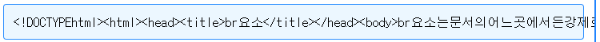

            - 2차 수정: 줄바꿈('\n')을 br태그(<br>)로 변경
                > 결과: 줄바꿈되게 출력 성공!  
                하지만 html태그에서 띄어쓰기를 인식하지 않아 탭이 제대로 출력되지 않음.
                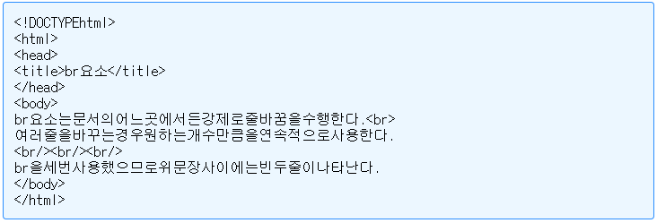

            - 3차 수정: 띄어쓰기(' ')를 &nbsp;로 변경
                > 결과: 모든 입력 내용이 제대로 출력됨!
                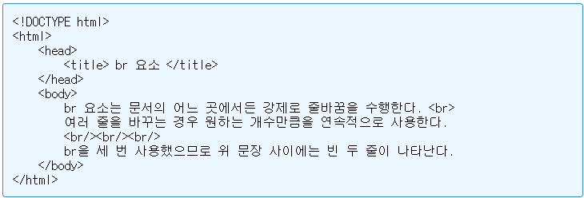

        **2. 코드 입력창을 단순한 Textarea가 아니라 선도 그어져 있고 줄 번호도 보이게 해서 Code editor처럼 만들고 싶었음.**
            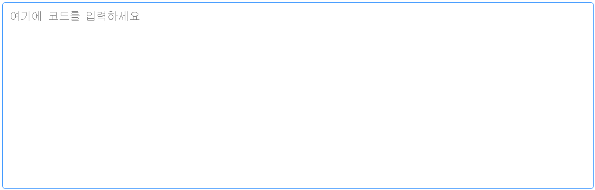
            - 1차 수정: css에 아래 옵션을 줘서 배경 색 변경 및 선 추가
                <pre>background-color: rgb(22, 31, 37);
                    /* 선 넣기 핵심 CSS */
                    background-image: linear-gradient(#1b82ff 1px, transparent 1px);
                    background-size: 100% 20px; /* line-height와 동일하게 설정 */
                    background-position: 0 10px; /* 텍스트 높이에 맞게 조절 */
                    line-height: 20px; /* 줄 높이 */
                </pre>
                > 결과: 선이 예쁘게 생겼음!  
                하지만 코드가 길어져 스크롤 바를 내리면 선이 따라 올라가지 않아 코드와 선이 겹침

                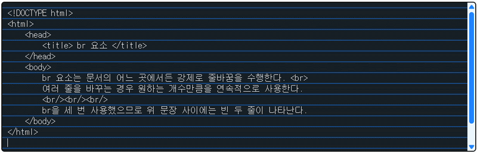

            - 2차 수정: background-attachment 옵션을 local로 설정
                <pre>background-attachment: local; /* 스크롤 시 배경도 같이 움직이도록 설정 */</pre>

                > 결과: 선이 스크롤을 올려도 따라서 잘 올라감.  
                이제 Textarea 왼쪽에 줄 번호를 추가하고 싶어짐.
                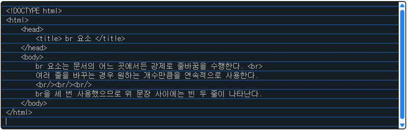

            - 3차 수정: line_numbers 클래스의 div 추가,  
                <pre>// 줄번호 추가용 javascript
                $(document).ready(function() {
                    const textarea = document.querySelector('#input_code');
                    const lineNumbers = document.querySelector('.line_numbers');

                    textarea.addEventListener('input', () => {
                        const lines = textarea.value.split('\n').length;
                        lineNumbers.innerHTML = Array(lines).fill(0).map((_, i) => `<span>${i + 1}</span>`).join('<br>');
                    });

                    // 스크롤 동기화
                    textarea.addEventListener('scroll', () => {
                    lineNumbers.scrollTop = textarea.scrollTop;
                    });
                });

                /* 줄 번호 css \*/
                .line_numbers {
                width: 15px;
                background-color: #d1e4ff;
                padding: 10px;
                text-align: right;
                color: rgb(41, 105, 194);
                font-family: monospace;
                font-size: 15px;
                line-height: 20px;
                user-select: none; /* 줄 번호 선택 방지 */
                overflow: auto;
                scrollbar-width: none;
                }

                &lt;!--&nbsp;html&nbsp;태그&nbsp;--&gt;<br>&lt;div&nbsp;class="code_editor"&gt;<br>&nbsp;&nbsp;&nbsp;&nbsp;&lt;div&nbsp;class="line_numbers"&gt;&lt;span&gt;1&lt;/span&gt;&lt;/div&gt;<br>&nbsp;&nbsp;&nbsp;&nbsp;&lt;textarea&nbsp;class="input_code"&nbsp;id="input_code"&nbsp;name="input_code"&nbsp;placeholder="여기에&nbsp;코드를&nbsp;입력하세요"&gt;&lt;/textarea&gt;<br>&lt;/div&gt;</pre>

                > 결과: 왼쪽에 줄번호가 잘 추가됨.  
                하지만 Tab키로 들여쓰기 및 내어쓰기가 되지 않아 스페이스바로 들여쓰기를 해야함.
                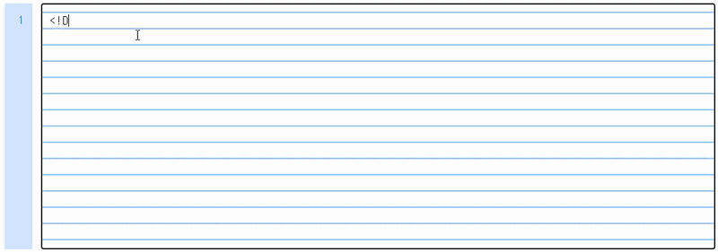

            - 4차 수정: JQuery를 이용하여 들여쓰기, 내어쓰기 기능 구현    
                <pre>$(document).ready(function() {
                $('#input_code').on('input', function(e) {
                    const value = $(this).val();
                    const lines = value.split('\n').length;
                    $('.line_numbers').html(Array(lines).fill(0).map((_, i) => `<span>${i + 1}</span>`).join('<br>'));
                });

                // 스크롤 동기화
                \$('#input_code').scroll(function() {
                    \$('.line_numbers').scrollTop($(this).scrollTop());
                });

                \$('#input_code').keydown(function(e) {
                    if (e.shiftKey && e.keyCode === 9) {  // Shift 키가 눌렸을 때 (keyCode 16)
                        e.preventDefault();  // 포커스 이동 막기
                        let start = \$(this).get(0).selectionStart;
                        let end = \$(this).get(0).selectionEnd;
                        let value = \$(this).val();
                        let lineStart = value.lastIndexOf('\n', start - 1) + 1;

                // 내어쓰기 로직
                for (let i = 4; i > 0; i--) {
                    if (value.substring(lineStart, lineStart + i) === ' '.repeat(i)) {
                        \$(this).val(value.substring(0, lineStart) + value.substring(lineStart + i));
                        \$(this).get(0).selectionStart = $(this).get(0).selectionEnd = start - i;
                        break;
                    }
                }
                    } else if (e.keyCode === 9) {
                        e.preventDefault();  // 포커스 이동 막기
                        let value = \$(this).val();
                        let start = \$(this).get(0).selectionStart;
                        let end = \$(this).get(0).selectionEnd;
                        const indent = "    ";
                        
                \$(this).val(value.substring(0, start) + indent + value.substring(end))
                \$(this).get(0).selectionStart = \$(this).get(0).selectionEnd = start + indent.length;
                    }
                });
            });</pre>

                > 결과: 'Tab' 키를 눌러 들여쓰기, 'Shift' + 'Tab' 키로 내어쓰기 기능 구현  
                하지만 윗줄의 들여쓰기가 아랫줄에 이어지지 않음.  
                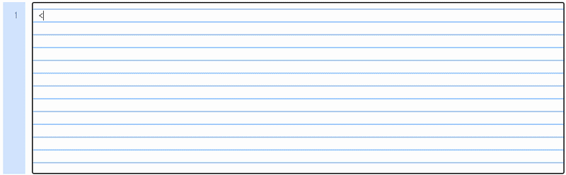

            - 5차 수정: 자동 들여쓰기를 JQuery로 구현
                <pre>$('#input_code').on('input', function(e) {
                const value = $(this).val();
                let start = $(this).get(0).selectionStart;
                let end = $(this).get(0).selectionEnd;

                    // 자동 들여쓰기
                    if (value.charAt(start - 1) === "\n") {
                        let prevLineStart = value.lastIndexOf('\n', start - 2) + 1;
                        let prevLine = value.substring(prevLineStart, start);
                                
                        if (prevLine.startsWith(" ")) {
                            let indentSize = prevLine.match(/^\s*/)[0].length;
                            let indent = " ".repeat(indentSize);
                            $(this).val(value.substring(0, start) + indent + value.substring(end));
                            $(this).get(0).selectionStart = $(this).get(0).selectionEnd = start + indent.length;
                        }
                    }
                });</pre>

                > 결과: 윗줄의 들여쓰기되어 있는 만큼 아랫줄에도 자동으로 들여쓰기 되도록 함.  
                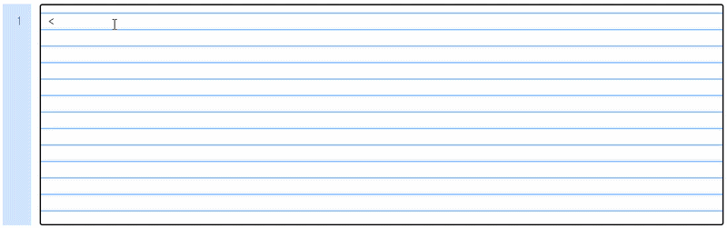

            - 기타 수정: CodeMirror를 이용한 CodeEditor 구현  

                <pre>// CodeMirror 적용 javascript
                var MyCodeMirror; // CodeMirror 인스턴스를 전역 변수로 선언
                $(document).ready(function() {

                    // CodeMirror 초기화
                    myCodeMirror  =  CodeMirror.fromTextArea ( document.getElementById("input_code"),  {
                        lineNumbers :  true , // 줄 번호 표시
                        matchBrackets :  true , // 괄호 자동 매칭
                        styleActiveLine :  true , // 현재 줄 강조
                        lineWrapping :  true, // 긴 줄 자동 줄바꿈
                        mode :  "htmlmixed" , // HTML 모드 설정
                        theme :  "default" , // 테마 설정 (원하는 테마로 변경 가능)
                        indentUnit :  4 , // 들여쓰기 단위 설정
                        tabSize :  4 , // 탭 크기 설정
                    } ) ;
                    });

                    function changeTheme() {
                        var selectedTheme = $("#theme_selector").val();
                        myCodeMirror.setOption("theme", selectedTheme);
                    };

                &lt;!-- body의 Textarea --&gt;
                &lt;textarea id="input_code" name="input_code" placeholder="여기에 코드를 입력하세요"&gt;&lt;/textarea&gt;
                </pre>

                > 결과: 앞의 3차 수정까지 구현했을 때 CodeMirror를 알게되었습니다. Textarea에 CodeMirror를 적용하고 테마 변경 가능하도록 했었는데 줄 번호만 보이고 선은 보이지 않는 점이 만족스럽지 않았었습니다.  
                이후 트러블 슈팅을 작성하던 중에 '이왕 구현했던 거 조금만 더 다시 구현해 볼까?'라는 생각이 들어 앞의 5차 수정까지 구현하게된 것인데  
                CodeMirror가 테마 변경도 가능하고 태그와 텍스트의 색도 구별이 되어 가독성이 좋았지만
                제가 직접 구현한 것이 줄번호, 선도 보이고 들여쓰기, 내어쓰기, 자동 들여쓰기 기능까지 구현되어서 CodeMirror 대신 제가 구현한 것을 쓰기로 결정하였습니다.
                
        
        **3. 코드 입력창 자동 들여쓰기 구현하기**  
        > 이전 버전의 html에서 직접 구현한 코드 입력창의 자동 들여쓰기 기능을 약간 수정하였습니다.  
        Jquery로 Enter키의 keydown 이벤트를 감지하여 쿼리가 동작하도록 수정하였는데  
        아래 줄에서 들여쓰기가 되지 않고 이전 줄 끝에 들여쓰기가 들어가는 문제가 발생하였습니다..

            - 원인: #input_code의 값을 slice(-1), endsWith("\n") 등으로 확인해 본 결과  
            줄바꿈(\n)이 되기 전에 구현한 쿼리가 실행된다는 것을 확인하였습니다.

        - 1차 수정: setInterval(), clearInterval()을 이용하여 "\n"가 입력될 때까지 대기해 보았습니다.  
            > 결과: "\n"가 입력되지 않고 setInterval()의 함수가 무한 반복되었습니다.☠️

        - 2차 수정: Enter키의 keydown 이벤트를 감지하는 것이 문제일까? 해서 keyup 이벤트를 감지하도록 수정하였습니다.
            <pre>$("#input_code").keyup(function(e) {
                if (e.keyCode === 13) {  // keyCode: 13(Enter키)
                    // 자동 들여쓰기
                    let value = $(this).val();
                    let start = $(this).get(0).selectionStart;
                    let end = $(this).get(0).selectionEnd;
                    let prevLineStart = value.lastIndexOf('\n', start - 2) + 1;
                    let prevLine = value.substring(prevLineStart, start);
                            
                    if (prevLine.startsWith(" ")) {
                        let indentSize = prevLine.match(/^\s*/)[0].length;
                        let indent = " ".repeat(indentSize);
                    
                        $(this).val(value.substring(0, start) + indent + value.substring(end + 2));
                        $(this).get(0).selectionStart = $(this).get(0).selectionEnd = start + indent.length;
                    }
                }
            });</pre>

            > 결과: 원하는대로 들여쓰기가 되긴하는데 커서가 이전과 달리 바꾼 줄의 맨 앞에 커서가 생겼다가 들여쓰기한 위치로 커서가 이동하는 것이 보였습니다.  
            그리고 문장의 맨 끝이 아닌 문단의 중간에서 들여쓰기를 하면 자동 들여쓰기가 적용된 새 줄이 생기지 않고 그 다음줄에 들여쓰기가 적용되었습니다.

            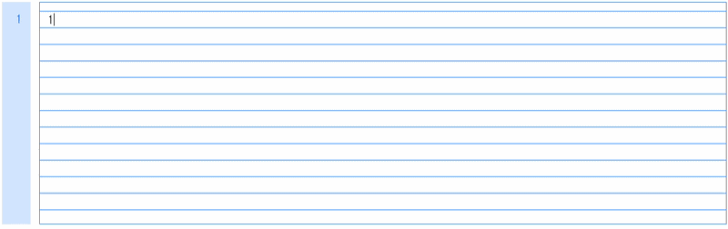
        
        - 3차 수정: #input_code의 textarea의 input 이벤트를 감지하여 현재 커서가 위치한 인덱스 이전의 문자가 "\n"이고 이전 줄이 들여쓰기로 시작했을 때(문장의 맨 앞이 공백으로 시작할 때) 들여쓰기 수행
            <pre>$('#input_code').on('input', function(e) {
                let value = $(this).val();
                let start = $(this).get(0).selectionStart;
                let end = $(this).get(0).selectionEnd;

                // 자동 들여쓰기
                if (value.charAt(start - 1) === "\n") {
                    let prevLineStart = value.lastIndexOf('\n', start - 2) + 1;
                    let prevLine = value.substring(prevLineStart, start);
                            
                    if (prevLine.startsWith(" ")) {
                        let indentSize = prevLine.match(/^\s*/)[0].length;
                        let indent = " ".repeat(indentSize);
                        $(this).val(value.substring(0, start) + indent + value.substring(end));
                        $(this).get(0).selectionStart = $(this).get(0).selectionEnd = start + indent.length;
                    }
                }
            });</pre>

            > 결과: 줄바꿈 시, 줄 맨 앞에 커서가 보였다가 들여쓰기 되는 것이 아니라 바로 들여쓰기 위치로 커서 이동 되었습니다.  
            맨 마지막 문단, 중간 문단 어디서든 엔터키를 치면 앞 줄의 들여쓰기 만큼 자동으로 들여쓰기 기능이 동작하도록 구현하였습니다.
            
            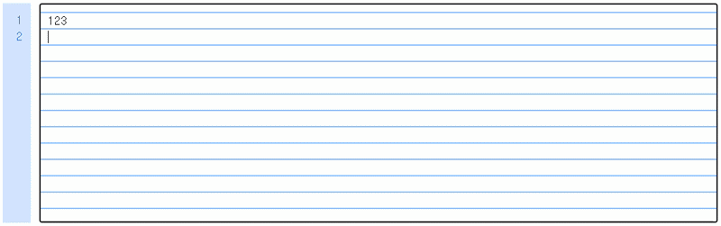

        **4. 데이터 저장 구조 선택**
        > 단원별 개념과 예제 코드를 JSON 데이터로 저장하려고 하니 조회할 때, 단원별로 조회하기 어려웠습니다.

        <pre>{
        "contents": [
            {
                "chapter": "제1장 웹 프로그래밍 개요", 
                "contents": [
                                {
                                    "subchapter": "1.1 웹 개요",
                                    "page": 2,
                                    "contents": []
                                }, ...
                            ]
                }, ...
            ]
        }</pre>


#### 데이터 업로드 및 수정 페이지 구성
> 개발을 하며 일일이 데이터를 입력 및 저장하는 것이 번거로울 것 같아서 편집 페이지를 만들게 되었습니다.

**수정 페이지 구성**
> 페이지 상단 radio 버튼으로 수정 유형 선택 → Jquery로 보이는 수정 페이지 변경


- 목차  
    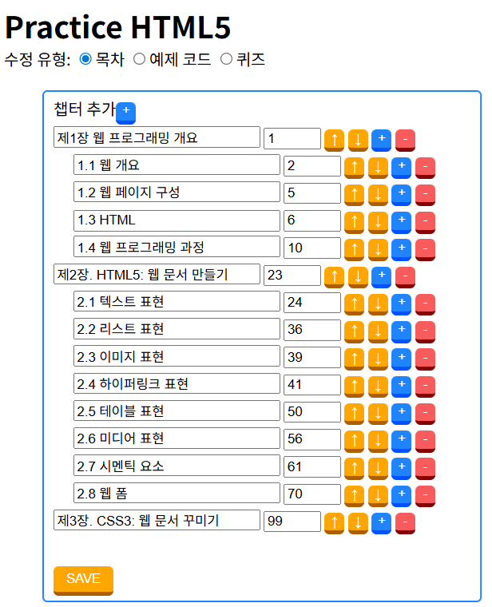
    - 상단 단원 추가 버튼 '+'
    - 추가된 단원 구성
        - 단원 제목
        - 페이지 번호
        - 단원 위로 옮기기 '↑': 현재 단원과 하위 단원을 함께 옮김
        - 단원 아래로 옮기기 '↓'
        - 소단원 추가 '+'
        - 소단원 제거 '-' : 하위 단원도 함께 제거
        - 저장 버튼 'SAVE'

- 개념 및 예제 코드  
    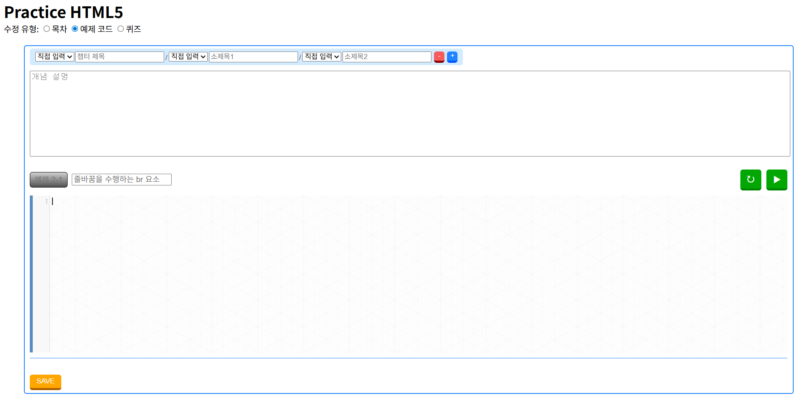
    - 단원 
        - 단원 입력 혹은 선택창
            > 단원을 직접 입력 혹은 저장된 데이터에서 선택 할 수 있음.
        - 소단원 추가 '+'
        - 소단원 제거 '-'
    - 개념
    - 예제 번호 
    - 예제 제목
    - 코드 입력창
    - 코드 변환 버튼 '↻': html raw 코드가 그대로 보이도록 변환
        - &lt; → \&lt;
        - &gt; → \&gt;
        - \\n → \<br\>
        - 공백(' ') → \&nbsp;
    - 코드 실행: 작성한 코드가 웹페이지에서 어떻게 보이는지 보여줌.
    - 저장 버튼 'SAVE'
- 퀴즈  
    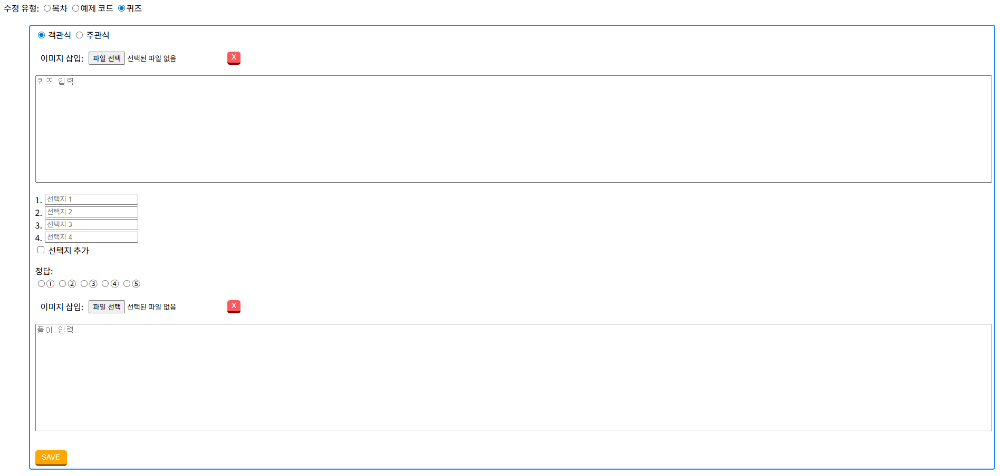
    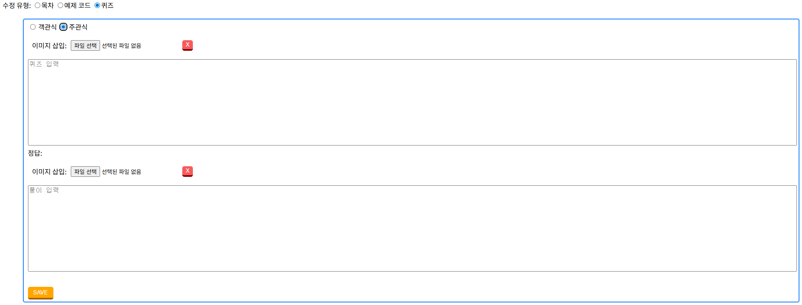
    - 퀴즈 타입 선택 radio 버튼
        > 현재 선택된 radio 버튼과 다른 radio 버튼 클릭 시, 퀴즈 수정창 변경 및 입력창(input 박스, textarea 등) 비움.
        - 객관식
        - 주관식
    - 문제
        - 사진 업로드
            - 사진 삭제
            - 사진 미리보기
            - 사진 크기 변경
                > 업로드된 사진이 있어야 보임  
                > 원본 사진 비율 유지
            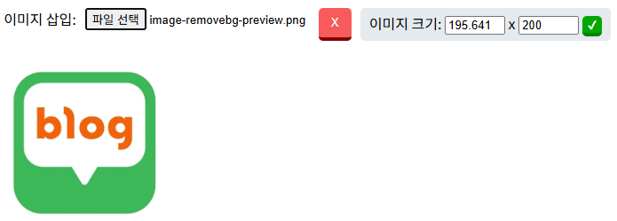
    - 퀴즈 문제 입력
    - 보기 입력
        - 기본: 1 ~ 4번
        - 선택지 추가: 5번
    - 정답
        - 보기: 1 ~ 5번
        - 사진
        - 풀이

